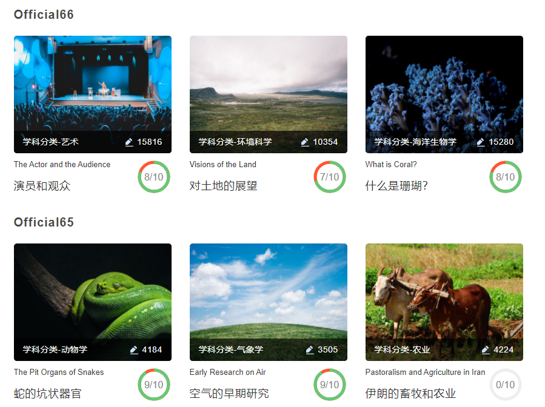
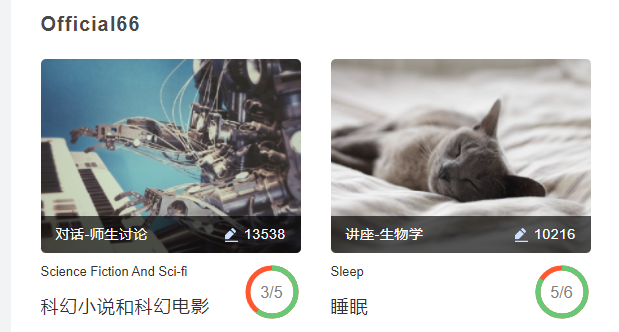
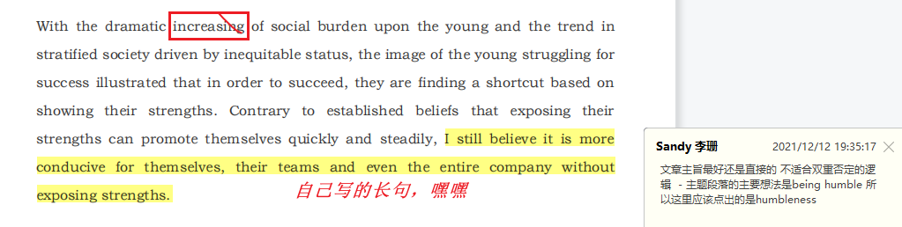
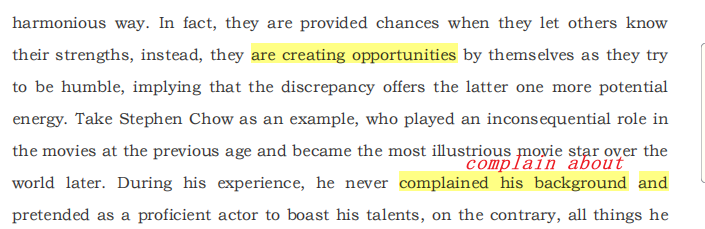

# self-criticism

## 2021/12/05 Monday

这周确定了托福最终考试日期1.22，但是实际上自己花在英语的时间真的多嘛？作业没做，老师的文档也没看…

这周有三件事完成的还是比较好的：

1. 周一的保密技术的论文报告，表现优秀，得到老师认可，挺不错的，一次很好的锻炼自己的机会
2. 第二件事是苟的软安实验，确实心态有些爆炸，遇到了好多问题，前前后后，两天的时间都在忙这个，并且周天的下午也都花在这里了。。英语又没有学
3. 完成了软安的PPT，很长高效很开心

另外这周为了搭建一个很好看的界面花了两个晚上的时间，挺值得的，有点需要从今天彻底改变：**早起！**

### 早起

下周任务：

> > 改掉晚睡晚起的习惯
> >
> > 每天英语的时间
> >
> > 信息安全PPT
> >
> > 每天持续学习ML

## 2021/12/13 Monday

上周的任务除了改掉晚睡晚起的习惯，其他的都做到了，继续坚持！

### 上周具体完成和学习的事情：

#### 托福英语

首先是每日一篇的英语阅读，确实有点儿问题大，距离阅读（30/30）的距离还是有点儿大…

做了两篇听力，凉凉…希望以后能够变好吧：

另外听了几篇非常好的听力，有一句！！

Rather than focus on the whole thing that you need to do, I would encourage you to focus on the **first two minutes.**

还有一句！！

And the insight that she realized is that habits are often the entry point, not the end point.

写作写了一篇，老师说整体上没什么大问题，具体在Toefl仓库里：

文章很多长句子，练手的，花了挺多时间远远长于正常的写作时间，之后得再强度训练中加速

口语，一直在咕咕咕……

#### 课程学习

都2202年了，不会还真有人卷课程吧…划水过了两个实验的验收，另外OS老师请假，一门结束了课程，其他课程在摸鱼…

- 完成了信安数学基础的PPT制作，组长的痛…
- 软安实验报告
- 密码学实验，一个系统的初步，刚开始…
- 日常摸鱼

#### 项目进展

emmm，CTF作品赛文件夹以斤建立好，然后也新建了一个仓库，看了一点儿论文，安装好了环境，基本任务算是完成好了

#### 课外学习

导师交代的任务（学习任务）还在进行中，目标是寒假进入老师的课题组，具体内容在io仓库里面，下面简单总结一下：

**Transformer**

- 重点是Seq2Seq的模型，早期用来作翻译的东东，主要是文字处理起初
- 现在运用非常广泛，“变形金刚”，图像处理等等，效果非常好，特定任务强于CNN，RNN
- Encoder、Decoder

**GAN**淦就完了！！

简单讲就是，**生成器和判别器的博弈**，生成器不断产生使判别器难以区分的样本，而判别器则不断更新能够对样本具有更高的辨别能力.

另外GAN是非常，非常“男”train的，如何train，多看论文…但是不能完全避免出现Model collapse，Mode Dropping的现象

### 下周任务

- [ ] 密码学实验
- [ ] 信安数学基础的考试！！！
- [ ] 早起
- [ ] 然后是坚持学习ML以及英语

